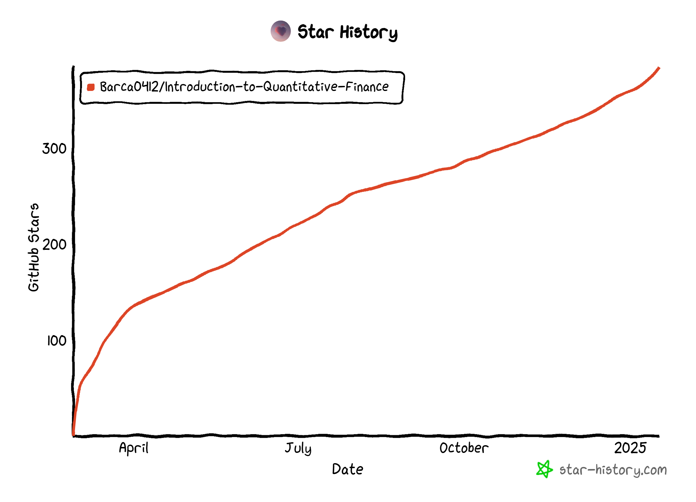
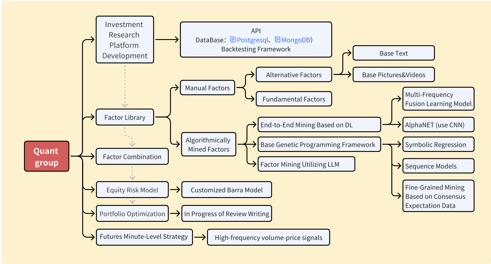

# 量化研究入门资料 (走过路过给个star！感谢朋友们)

 

目录：

- [基于多因子股票量化投研框架的开源教程](#基于多因子股票量化投研框架的开源教程)
- [我的资料](#section1)
- [AI+金融论文整理](#section-arxiv) 🆕
- [公开资料整理](#section2)
-----

<!--

  
欢迎star，欢迎一同contribute

  
     

-->

  
欢迎star⭐，欢迎一同contribute

  <table>
    <tr>
      <td align="center" width="33%">
        
      </td>
      <td align="center" width="33%">
        
      </td>
      <td align="center" width="33%">
        
      </td>
    </tr>
  </table>
    

# 基于多因子股票量化投研框架的开源教程

- 本部分计划开源自湖南大学金融科技协会Quant Group的研究内容，框架（英文版）如下图

   
  
     

- 湖南大学金融科技协会的详细介绍：https://www.guohaoqi.cn/hft-association ，欢迎关注我们

# 我的资料

暂时包括：

- 量化金融、机器学习、数学参考书与资料📐
- 技术指标回测代码👨‍💻
- 卖方金工研报📈
- 投资者情绪与行为金融相关论文🎲
- [量化研究实习中的代码知识（比较杂乱）](https://github.com/Barca0412/Note-for-Programming)
- ...

待添加：

- 量化笔试、MFE刷题📕
- 组合优化🔢
- 机器学习因子挖掘💻
- ...

# AI+金融论文整理

每日自动更新 arXiv 上 AI+金融相关论文，使用 LLM 生成中文概述与标签。

- 📰 **每日更新**: 自动抓取 q-fin、cs.LG+finance 相关论文
- 🤖 **智能分析**: 使用大模型生成中文摘要和关键贡献
- 🏷️ **主题分类**: Asset Pricing、LLM、Factor Mining、RL 等标签

## [📄 论文日报汇总](./论文/AI金融论文整理/README.md)

- 点击查看每日论文更新和主题分类

# 公开资料整理

## [数据源与另类数据](./资料/数据源与另类数据.md)

- 点击跳转

## [回测框架相关](./资料/回测.md)

- 点击跳转

## [因子挖掘与评估](./资料/因子挖掘.md)

- 点击跳转

## [因子组合](https://xwfixqlhmsm.feishu.cn/wiki/PkCdw7MpKixStVkyIHwcTVhKngh?from=from_copylink)

- 点击跳转

## [投资组合优化与风控](./资料/投资组合优化与风控.md)

- 点击跳转

## [基金研究与FoF]()

- 点击跳转

## Quant项目

### 多因子量化框架
- [microsoft/qlib](https://github.com/microsoft/qlib) - AI导向量化投资平台，支持自动因子挖掘
- [etccapital/MultiFactor](https://github.com/etccapital/MultiFactor) - 基于华泰研报的多因子回测框架
- [HUANG-NI-YUAN/Multi-Factor_Model](https://github.com/HUANG-NI-YUAN/Multi-Factor_Model) - 15因子量化投资框架

### 回测框架
- [kernc/backtesting.py](https://github.com/kernc/backtesting.py) - 简洁高效Python回测库
- [polakowo/vectorbt](https://github.com/polakowo/vectorbt) - 极速向量化回测，支持大规模参数优化
- [stefan-jansen/zipline-reloaded](https://github.com/stefan-jansen/zipline-reloaded) - Quantopian事件驱动框架维护版

### 因子挖掘与机器学习
- [RndmVariableQ/AlphaAgent](https://github.com/RndmVariableQ/AlphaAgent) - KDD 2025 LLM驱动因子挖掘
- [nshen7/alpha-gfn](https://github.com/nshen7/alpha-gfn) - GFlowNet挖掘alpha因子
- [microsoft/RD-Agent](https://github.com/microsoft/RD-Agent) - 多Agent自动化R&D

### 投资组合优化
- [dcajasn/Riskfolio-Lib](https://github.com/dcajasn/Riskfolio-Lib) - 专业组合优化，24种风险度量
- [PyPortfolioOpt](https://pyportfolioopt.readthedocs.io) - 高效前沿、Black-Litterman

### 强化学习交易
- [AI4Finance-Foundation/FinRL](https://github.com/AI4Finance-Foundation/FinRL) - 开源金融强化学习框架
- [AI4Finance-Foundation/FinRL-Trading](https://github.com/AI4Finance-Foundation/FinRL-Trading) - 实盘交易v2.0

### 深度学习时序预测
- [gonzalopezgil/xlstm-ts](https://github.com/gonzalopezgil/xlstm-ts) - 扩展LSTM时间序列预测
- [sinanw/lstm-stock-price-prediction](https://github.com/sinanw/lstm-stock-price-prediction) - LSTM多变量股价预测

### 情感分析
- [FelixCharotte/NLP_Fnews](https://github.com/FelixCharotte/NLP_Fnews) - LLaMA 3财经新闻情感分析
- [Kanishk1420/FinReport](https://github.com/Kanishk1420/FinReport-Explainable-Stock-Earnings-Forecasting-via-News-Factor) - FinBERT+LSTM收益预测

### 加密货币
- [freqtrade/freqtrade](https://github.com/freqtrade/freqtrade) - 开源加密货币交易机器人
- [Open-Trader/opentrader](https://github.com/Open-Trader/opentrader) - 自托管交易机器人

### 综合平台
- [vnpy/vnpy](https://github.com/vnpy/vnpy) - VeighNa国产量化交易框架
- [leoncuhk/awesome-quant-ai](https://github.com/leoncuhk/awesome-quant-ai) - AI/ML量化资源精选
- https://github.com/chaosquant2022/ML-Quant
- ...

## 高频交易

- [nkaz001/hftbacktest](https://github.com/nkaz001/hftbacktest) - 高频交易和做市回测框架，支持L2/L3 Tick数据
- [sohaibelkarmi/High-Frequency-Trading-Simulator](https://github.com/sohaibelkarmi/High-Frequency-Trading-Simulator) - 市场微观结构研究沙盒，C++17限价簿
- [visualHFT/VisualHFT](https://github.com/visualHFT/VisualHFT) - 实时市场微观结构分析，VPIN等指标
- [High-Frequency-Trading-Model-with-IB](https://github.com/jamesmawm/High-Frequency-Trading-Model-with-IB)
- [hummingbot:high-frequency crypto trading bots](https://github.com/hummingbot/hummingbot)
- [tribeca:A high frequency, market making cryptocurrency trading platform](https://github.com/michaelgrosner/tribeca)
- ...

## 基金研究

- [FundCombination](https://github.com/MrDujing/FundCombination)
- ...

## 量化论坛

- 国内

  - [聚宽量化交易平台](https://www.joinquant.com/)
  - [VeighNa量化社区](https://www.vnpy.com/forum/)
  - [掘金量化社区](https://bbs.myquant.cn/)
  - [Datayes!优矿](https://uqer.datayes.com/v3/community/list)
  - [开拓者社区](https://www.tbquant.net/forum)
  - [BigQuant](https://bigquant.com/)
  - [发明者量化](https://www.fmz.com/)
  - [真格量化](https://quant.pobo.net.cn/login#/)
  - ...
- 国外

  - [Allocate Smartly](https://allocatesmartly.com/)
  - [Financial Hacker](https://financial-hacker.com/)
  - [Quantstart](https://www.quantstart.com/)
  - [Macrosynergy](https://research.macrosynergy.com/)
  - [Raposa](https://raposa.trade/blog/)
  - [Finominal](https://finominal.com/?country=US)
  - ...

## 课程&学习

- [金融大数据量化分析](https://github.com/plouto-quants/FBDQA-2019A)
- [人大：《金融计量与量化策略分析》《量化投资交易策略分析与系统设计》](https://github.com/xhlgogo/Quantitative-Investment-Trading-system)
- [Datawhale量化开源课程](https://github.com/datawhalechina/whale-quant)
- ...

## 一些工具[暂存]

- [Connected papers](https://www.connectedpapers.com/)
- [from Data to Viz](https://www.data-to-viz.com/)
- [Python Graph Gallery](https://python-graph-gallery.com/)
- [Z-library](https://z-library.se/?signAll=1&ts=0441&afterGeoRedirection=1)
- [查金融工作论文:SSRN](https://www.ssrn.com/index.cfm/en/)
- [arxiv](https://arxiv.org/)
- ...

<!-- 
入门资料大致分成三个部分,可点进对应的子页面浏览
- [编程与算法👨‍💻](https://github.com/Barca0412/Introduction-to-Quantitative-Finance/blob/main/Programming%20and%20Algorithm.md)
- [数学与统计📐](https://github.com/Barca0412/Introduction-to-Quantitative-Finance/blob/main/Mathematics%20and%20Statistics.md)
- [金融📈](https://github.com/Barca0412/Introduction-to-Quantitative-Finance/blob/main/Finance.md)
-->

---

By the way 所整理资料可能有不完善的地方,如有好的建议可移步 `Discussions` 留言

或联系：📫Email：qgh124430@hnu.edu.cn, 📞Wechat：qgh985695077
